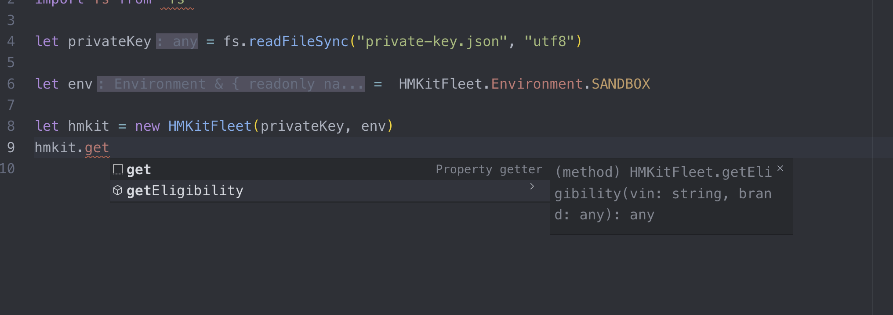
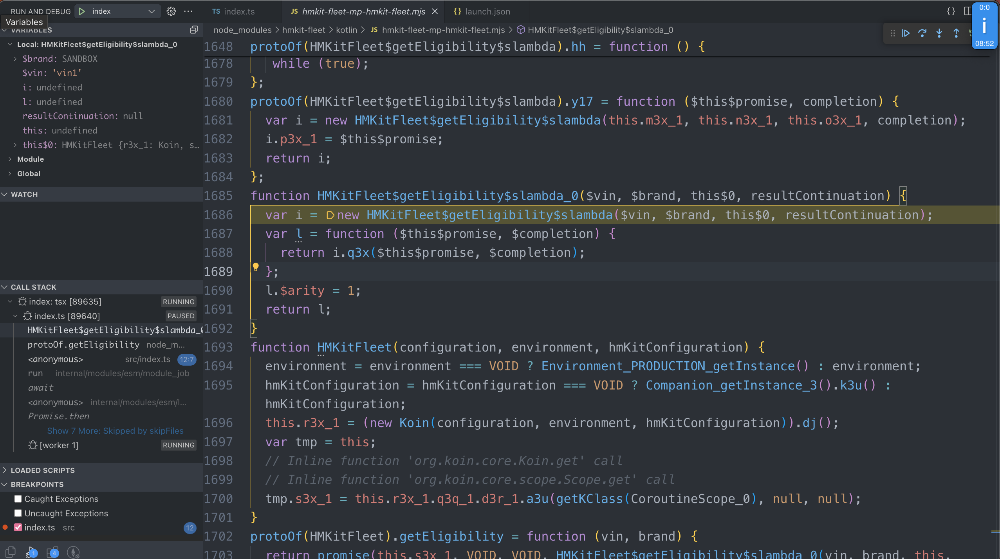

<!-- TOC -->
  * [Current status](#current-status)
  * [build/run java/js targets](#buildrun-javajs-targets)
    * [run js](#run-js)
    * [run jvm](#run-jvm)
    * [native](#native)
  * [positives](#positives)
  * [negatives](#negatives)
  * [debugging crashes](#debugging-crashes)
    * [js stack trace](#js-stack-trace)
    * [js debugger](#js-debugger)
    * [java stack trace](#java-stack-trace)
    * [java debugging](#java-debugging)
    * [issues](#issues)
<!-- TOC -->

## Current status

jvm and js targets working with `getEligibility` request.
It creates jwt and gets auth token with it. Then it uses the token in getEligibility request.

- jvm crypto - hmcrypto-java
- js crypto - jsrsasign

Next request implementations are trivial because crypto and auth is the hardest part.

## build/run java/js targets

### run js

build and run js:

`./gradlew assemble && cd hmkit-fleet-consumer-js && yarn && tsx ./src/index.ts && cd -`

continuous building - don't have to manually build on every change

`./gradle assemble --continuous`
in js folder: `yarn && tsx ./src/index.ts`

- js will be located in `build/dist/js/productionLibrary/`
- java will be located in `build/libs/`

### run jvm

`./gradlew :consumer-jvm:run `

### native

currently not implemented

## positives

- Main purpose of sharing the http request logic with Coroutines can be exported to both JVM and JS.

Coroutines work. Ktor http client works.

- has code completions with Typescript .d.ts definitions
    - can generate TS docs from this

```typescript
// import { HMKitFleet, Environment } from "hmkit-fleet" // types working
import { HMKitFleet, Environment } from "hmkit-fleet/kotlin/hmkit-fleet-mp-hmkit-fleet.mjs" // build working
import fs from "fs"

let privateKey = fs.readFileSync("private-key.json", "utf8")

let env =  Environment.SANDBOX

let hmkit = new HMKitFleet(privateKey, env)

hmkit.getEligibility("vin1", env).then((response) => {
  console.log(response)
})
```


check out generated types in [docs](./docs/hmkit-fleet-hmkit-fleet.d.ts)

## negatives

- if run into a problem, then it is probably a lot slower/impossible to resolve it. Jetbrains needs to update
  their multiplatform. For instance their TypeScript support is experimental, but Typescript has been around for a long
  time already.
- There is more overhead to manage 2 platforms
- need separate HMKitFleet classes for js and jvm. It's because Js has Promise return type and Java
  has CompletableFuture. These return types cannot be mixed in Kotlin

## debugging crashes

### js stack trace

```
➜ node index.js
  throw SerializationException_init_$Create$(notRegisteredMessage(_this__u8e3s4) + 'To get enum serializer on Kotlin/JS, it should be annotated with @Serializable annotation.');
        ^
SerializationException: Serializer for class 'Brand' is not found.
Please ensure that class is marked as '@Serializable' and that the serialization compiler plugin is applied.
To get enum serializer on Kotlin/JS, it should be annotated with @Serializable annotation.
    at platformSpecificSerializerNotRegistered (/opt/buildAgent/work/b2fef8360e1bcf3d/core/jsMain/src/kotlinx/serialization/internal/Platform.kt:45:11)
    at serializer (/opt/buildAgent/work/b2fef8360e1bcf3d/core/commonMain/src/kotlinx/serialization/Serializers.kt:134:10)
    at requestBody (/opt/buildAgent/work/b2fef8360e1bcf3d/core/commonMain/src/kotlinx/serialization/internal/Platform.common.kt:80:1)
    at $getEligibilityCOROUTINE$0.protoOf.hh (/Users/tonis/workspace/src/commonMain/kotlin/network/UtilityRequests.kt:49:20)
```

It shows the Kotlin line where the exception was thrown(`UtilityRequests.kt:49:20`). Not problematic to debug.

### js debugger

node js: they recommend normal node
debugging: https://nodejs.org/en/docs/guides/debugging-getting-started#jetbrains-webstorm-2017-1-and-other-jetbrains-ides

The mjs source code for this is not clean, but it is kind of readable


### java stack trace

The java compiled version looks exactly like the current one. I think there won't be any difference for the clients.

TODO: verify. also verify package is correct (for spring targets that require a package)

### java debugging

With implementation project(""), the debugging works normally.

TODO: Share the jvm lib and verify can debug with shared library as well.

### issues

currently cannot get both building and types working in js. I don't know how to map .mjs with types in vscode.